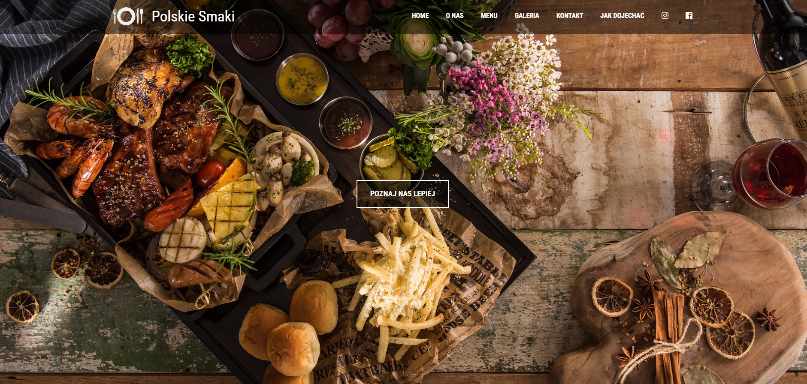
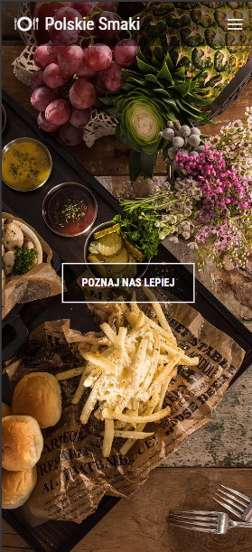

# Restaurant Website 🍽️



A responsive restaurant website built with **HTML, CSS and Vanilla JavaScript**.

This project was created to practice building a modern responsive landing page using fundamental frontend technologies.

---

## Live Demo

👉 https://sebastianjuszczynski.github.io/restaurant/

---


# Project Overview

The goal of this project was to improve core frontend development skills by creating a realistic restaurant website layout.

During development I focused on:

- building a clean page structure with HTML
- styling the layout using CSS
- adding interactivity using JavaScript
- creating a responsive design
- organizing project files properly

---

# Features

- Responsive layout
- Modern restaurant landing page design
- Navigation menu
- Styled sections (menu, about, contact etc.)
- Interactive elements powered by JavaScript
- Clean and simple user interface

---

# Tech Stack

### Frontend

<p>

</p>

### Tools

<p>

</p>

---

# Installation

Clone the repository

```bash
git clone https://github.com/sebastianjuszczynski/restaurant.git
```

Navigate to the project folder

```bash
cd restaurant
```

Open the project

Simply open the `index.html` file in your browser.

---

# What I Learned

While building this project I improved my understanding of:

- semantic HTML structure
- CSS layout and styling
- responsive design
- DOM manipulation in JavaScript
- organizing frontend projects

---

# Possible Future Improvements

Possible improvements for this project include:

- adding a reservation form
- improving mobile navigation
- adding animations
- integrating a backend for reservations
- improving accessibility

---

# Author

Sebastian Juszczyński

Frontend developer focused on building modern web applications with **JavaScript and React**.

GitHub  
https://github.com/sebastianjuszczynski
